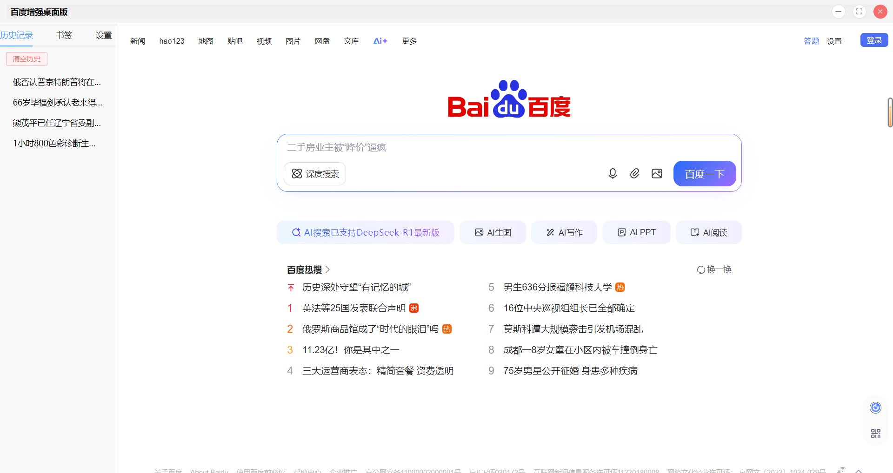

# 百度增强桌面版


一个基于 Electron 和 Vue 3 构建的、功能增强的百度桌面客户端。

## ✨ 功能特性

- **[✅] 自定义窗口:** 拥有自定义标题栏的无边框窗口。
- **[✅] 网页内容:** 通过 `BrowserView` 加载百度首页。
- **[✅] 基本控制:** 可通过自定义标题栏实现窗口的最小化、最大化和关闭。
- **[✅] 本地历史与书签:** 侧边栏可自动追踪搜索历史和手动添加书签。
- **[✅] 全局热键:** 从系统任何地方快速唤醒应用并聚焦搜索框。
- **[✅] 暗黑模式:** 为百度页面定制的暗黑主题。
- **[✅] 系统托盘:** 让应用在后台运行，并提供快捷操作。
- **[✅] 每日热点通知:** 每天定时推送一条百度热搜新闻作为原生桌面通知。
- **[✅] 数据持久化:** 使用 `electron-store` 持久化历史记录和书签。
- **[✅] 自动更新:** 应用启动时检查并下载最新版本。

## 🚀 快速开始

**1. 安装依赖:**
```bash
npm install
```

**2. 启动开发模式:**

> **重要提示:** 你需要开启两个终端。

- **终端 1:** 启动 Vite 前端开发服务器。
  ```bash
  npm run dev
  ```
- **终端 2:** 启动 Electron 主进程。
  ```bash
  npm run start
  ```

**3. 构建生产包:**
```bash
npm run build
```

## 🛠️ 技术栈

- **Electron**
- **Vue 3** (使用 Vite)
- **Pinia** (用于状态管理)
- **Element Plus** (用于 UI 组件)
- **electron-store** (用于本地数据持久化)

